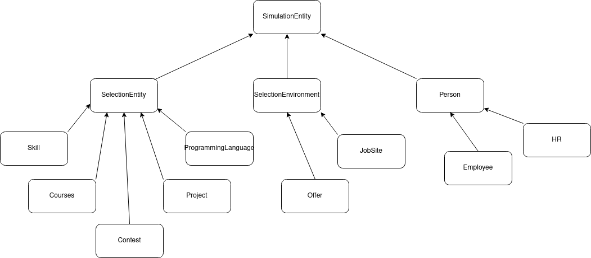

# Lab 6
The first thing I did was to incorporate the *Builder* pattern for the main classes of the simulation (`HR` and `Employee`). The reason is that because some of these classes had so many parameters for their constructors my eyes started bleeding. Why not use polymorphism for constructors ? Because I wanted to create different configurations for these objects and have a fast way to create these configurations.

Here is how I did with the `Employee` class. First, I cleared the huge list of parameters and left only the ones constructed by the superclass. And this is the only thing the constructor does. It calls the superclass's constructor. This will aid in creating the necessary builder step. Here is how `Employee` looks like now:

```c#
public class Employee : Person {
        public int desiredSalary { get; set; }
    public List<Skill> skills { get; set; } = new List<Skill>();
    public List<ProgrammingLanguage> programmingLanguages { get; set; } = new List<ProgrammingLanguage>();
    public List<Course> courses { get; set; } = new List<Course>();
    public List<Contest> contests { get; set; } = new List<Contest>();
    public string? type { get; set; }

    public Employee (
        string employeeFirstName,
        string employeeLastName,
        int employeeAge,
        int employeeYearsOfXP
    ) : base (employeeFirstName, employeeLastName, employeeAge, employeeYearsOfXP) {}
}
```

Next, I needed to create an interface for the builder class. It goes through every `Employee` creation step deleted earlier from the constructor, but with some changes to make it easier to create such objects. Here it is:

```c#
public interface EmployeeBuilder {
    void buildPersonalData(string employeeFirstName, string employeeLastName);
    void buildSkillsData();
    void buildProgrammingLanguagesData();
    void buildProjectsData();
    void buildCoursesData();
    void buildContestsData();
    Employee getResult();
}
```

And we have two builders: `WebDeveloperBuilder` and `MLEngineerBuilder`. They differ not too much, so I'll show you the first one only:

```c#
public class WebDeveloperBuilder: EmployeeBuilder {
    private Employee _employee;
    Random rnd = new Random();

    public void buildPersonalData(
        string employeeFirstName,
        string employeeLastName
    ) {
        int employeeAge = rnd.Next(18, 65);
        int employeeYearsOfXP = rnd.Next(0, 47);
        int employeeDesiredSalary = rnd.Next(500, 1_000_000);

        _employee = new Employee(employeeFirstName, employeeLastName, employeeAge, employeeYearsOfXP);
        _employee.desiredSalary = employeeDesiredSalary;
    }

    public void buildSkillsData() {
        string[] skillNames = new string[] {"teamwork", "punctual", "fast learner"};
        string[] skillDomains = new string[] {"frontend", "backend", "full stack"};
        bool[] flag = new bool[] {true, false};

        _employee.skills.Add(new Skill(
            skillNames[rnd.Next(0, skillNames.Length - 1)],
            rnd.Next(1, 5),
            flag[rnd.Next(0, 1)],
            skillDomains[rnd.Next(0, skillDomains.Length - 1)]
        ));
    }

    public void buildProgrammingLanguagesData() {
        // similar to the above
    }

    public void buildProjectsData() {...}

    public void buildCoursesData() {...}

    public void buildContestsData() {...}

    public Employee getResult() {
        return _employee;
    }
}
```

For an even easier way of creating `Employee`s (especially when you want to create a certain number of them) I created a director class that will do the thing for me and will return a list of employees:

```c#
public class EmployeeDirector  {
    public void populateListOfEmployees(EmployeeBuilder builder, List<Employee> employees, int n = 5, string type = "Web Dev") {
        for (int i = 0; i < n; i++) {
            builder.buildPersonalData(type + " Employee", (employees.Count + 1).ToString());
            builder.buildSkillsData();
            builder.buildProgrammingLanguagesData();
            builder.buildProjectsData();
            builder.buildCoursesData();
            builder.buildContestsData();

            employees.Add(builder.getResult());
        }
    }
```
And here is how it is used:

```c#
List<Employee> employees = new List<Employee>();
WebDeveloperBuilder builder = new WebDeveloperBuilder();
MLEngineerBuilder builder2 = new MLEngineerBuilder();
EmployeeDirector director = new EmployeeDirector();

director.getListOfEmployees(
    builder,
    employees
);

director.getListOfEmployees(
    builder2,
    employees,
    5, "ML"
);

for (int i = 0; i < 10; i++)
    Console.WriteLine(employees[i].firstName + " " + employees[i].lastName);
```
The result is:
```
Web Dev Employee 1
Web Dev Employee 2
Web Dev Employee 3
Web Dev Employee 4
Web Dev Employee 5
ML Employee 6
ML Employee 7
ML Employee 8
ML Employee 9
ML Employee 10
```

For the `HR` class it is very similar. The difference is that the `HR` class is simpler.

## MVC my program
For the purpose of integrating an MVC architecture into my simulation many things had to be rearranged, some functions rewritten, something deleted, something added. Let's start from the top to see how the simulation will be run:
```c#
Controller simulationController = new Controller();

// configuration (you may leave default values if you want and skip this part)
simulationController.setHRNum(10);
simulationController.setOffersPerHR(7);
simulationController.setSitesNum(2);
simulationController.setEmployeeNum(20);

// run the simulation (in iterative mode, rather than infinite mode)
simulationController.simulate(10);
```

The `View` is the simplest of the 3 in my case. It is responsible for writing text on the screen and for the I/O of the application:
```c#
public class View {
    public void simulationStart() {
        Console.Clear();
        Console.WriteLine("====Simulation started====");
        Console.WriteLine("\tIteration 1");
        Console.WriteLine("==========================");
    }

    public void simulationEnd() {
        Console.WriteLine("====Simulation ended====");
    }

    public void writeIterationStatistics(int successes, int fails) {
        Console.Write("There were ");
        Console.ForegroundColor = ConsoleColor.DarkYellow;
        Console.Write("" + (successes + fails));
        Console.ForegroundColor = ConsoleColor.White;
        Console.Write(" jobs applications. Out of them ");
        Console.ForegroundColor = ConsoleColor.Green;
        Console.Write("" + successes);
        Console.ForegroundColor = ConsoleColor.White;
        Console.Write(" employees were hired and ");
        Console.ForegroundColor = ConsoleColor.Red;
        Console.Write("" + fails);
        Console.ForegroundColor = ConsoleColor.White;
        Console.WriteLine(" were not.");
    }

    public void renderSimulation(int iterations, ConsoleKey exitKey, Action runIteration) {
        int i = 0;

        if (iterations == -1)
            while (true) {
                if (Console.KeyAvailable && Console.ReadKey(true).Key == exitKey)
                    break;

                runIteration();

                i++;
            }
        else
            while (i < iterations) {
                runIteration();

                i++;
            }
    }
}
```

The `Model` stores the state of the simulation and all the required data. It also has methods that perform all the required data manipulations for the simulation, like creating `Offer`s for `HR`s or putting these offers on a `JobSite`:
```c#
public class Model {
    public List<Employee> employees {get; set;} = new List<Employee>();
    WebDeveloperBuilder webDevBuilder {get; init;} = new WebDeveloperBuilder();
    MLEngineerBuilder mlBuilder {get; init;} = new MLEngineerBuilder();
    EmployeeDirector employeeDirector {get; init;} = new EmployeeDirector();

    public List<HR> hrs {get; set;} = new List<HR>();
    CommonHRBuilder hrBuilder {get; init;} = new CommonHRBuilder();
    HRDirector hrDirector {get; init;} = new HRDirector();

    public List<JobSite> sites {get; set;} = new List<JobSite>();

    // simulation state 
    public int hrNum {get; set;} = 5;
    public int employeeNum {get; set;} = 5;
    public int offersPerHR {get; set;} = 5;
    public int sitesNum {get; set;} = 1;

    private Random rnd = new Random();

    // populates employees and hrs lists with initial values based on the rules
    // described in the respective builders
    public void initSimulationState() {...}

    // post state function where each hr creates offers for job sites
    public void createOffers() {...}

    // post state function where each hr posts the offers created earlier
    public void postOffers() {...}

    public void removeOffer(JobSite site, HR hr, Offer offer) {...}

    public void levelUpEmployee(Employee employee) {...}
}
```

The glue of the above two parts is the `Controller`, which is responsible for running all the steps of the simulation and communicating with the `Model` to access, modify, update or delete data, and communicating with the `View` to display the necessary information for the user:
```c#
public class Controller {
    Model model {get; init;} = new Model();
    View view {get; init;} = new View();

    public int successes {get; set;} = 0;
    public int fails {get; set;} = 0;

    Random rnd {get; init;} = new Random();

    private void postStep() {...}

    private Offer chooseOffer(JobSite site) {...}

    private bool applyToJob(Employee employee, JobSite site) {...}

    private void jobSearchStep() {...}

    private void simulationStep() {...}

    public void simulate(int n = -1) {
        view.simulationStart();
        model.initSimulationState();
        view.renderSimulation(n, ConsoleKey.Q, simulationStep);
        view.simulationEnd();
    }

    // methods for simulation configuration
    public void setHRNum(int n) { model.hrNum = n; }
    public void setEmployeeNum(int n) { model.employeeNum = n; }
    public void setOffersPerHR(int n) { model.offersPerHR = n; }
    public void setSitesNum(int n) { model.sitesNum = n; }
}
```
And this is how I integrated MVC into my simulation.

# Simulating the hiring process in IT
I chose to simulate the hiring process. For this purpose I thought of 9 classes that are related to the hiring process and one class that will perform the simulation.

# Lab 4
First two scenarios are related. First I will present them, then I will explain why they work.
## Scenario 1
HR evaluates an HR:
```cs
HR Aliona = new HR(...);
HR Maria = new HR(...);

Console.Write("Aliona will hire Maria: ");
Console.WriteLine(Aliona.evaluate(Maria));
```

## Scenario 2
HR evaluates an Employee:
```cs
string[][] PLDomains = new string[][] {
    new string[] {"backend", "game dev"},
    new string[] {"frontend", "backend"}
};

Employee Mark = new Employee(...);

Console.Write("Aliona will hire Mark: ");
Console.WriteLine(Aliona.evaluate(Mark));
```

As you can see the method of `HR` - `evalute()` - works with both `HR` and `Employee`. It considers individual aspects of both classes. This is why `Person` was not used as a type for the parameter of the method. Instead we have parametric polymorphism:

```cs
// evaluate an employee (hire or not hire)
    public bool evaluate(Employee employee) {
        int points = 0;

        points += _evaluateSkills(employee) + _evaluateProjects(employee);

        return points >= this.threshold;
    }

    public bool evaluate(HR employee) {
        int points = 0;

        // evaluate hrs based on number of offers and number of projects
        points += offers.Length + projects.Count;

        return points >= this.threshold;
    }
```

Note that HR interacts with `Skill`s and `Project`s every time it interacts with an `Employee` and it interacts with `Offer`s and `Poject`s every time it interacts with another `HR`.

## Scenario 3
HR creates an Offer:

```cs
Aliona.createOffer("Data Engineer", 10_000);
```

## Scenario 4
HR posts an Offer on a JobSite:

```cs
JobSite Rabota = new JobSite(
    "rabota",
    new List<Offer> {},
    "www.rabota.md"
);

Aliona.postOffer("Data Engineer", Rabota);
```


# Lab 3
For this laboratory work I had to think of a way so that every class will inherit from a root class, having another inheritance layer between them.

Here is the inheritance diagram:


## Simulation root class

Let's start with the root:

`Simulation` class is looking like this:
```cs
public abstract class SimulationEntity {
    public int numInteractions { get; set; } = 0;
}
```
The only thing in common to all the actors are the num of interactions with other actors that will be counted. This is for statistics.

## SelectionEntity class
`SelectionEntity` is storing information of all that classes that will be used to seelct an employee by an hr for a position. This class looks like this:

```cs
public abstract class SelectionEntity : SimulationEntity {
    public string name { get; init; }
    public string domain { get; set; }
    public string[] domains { get; set; }

    protected SelectionEntity(string entityName, string entityDomain) { ... }

    // same constuctor, different signature
    protected SelectionEntity(string entityName, string[] entityDomains) { ... }
}
```
As you can see it has two constructor signatures. It is due to the fact that the `ProgrammingLanguage` class requires a list of domains, contrary to all the other classes that require a single domain. This is because programming languages can be used in multiple domains.

## SelectionEnvironment
Classes that inherit from `SelectionEnvironment` are the 'sandboxes', where employees will find jobs. It is the bridge between an employee and an hr. They will find each other through `Offer`s from `JobSite`s and then begin interaction.

Here is how this class looks like:

```cs
public abstract class SelectionEnvironment : SimulationEntity {
    public string country { get; init; }
    public string url { get; init; }

    protected SelectionEnvironment(string envCountry, string envUrl) { ... }
}
```

## Person
This is straightforward. An `Employee` and an `HR` are both persons. They have similar characteristics like `firstName`, `age` or they both have a list of `Project`s.

Here is the class itself:

```cs
public class Person : SimulationEntity {
    public string firstName { get; init; }
    public string lastName { get; init; }
    public int age { get; init; }
    public int yearsOfXP { get; init; }

    public List<Project> projects { get; set; }
    
    public Person(string personFirstName,
                    string personLastName,
                    int personAge,
                    int personYearsOfXP,
                    string[] projectNames,
                    string[] projectLanguages,
                    string[] projectDomains) { ... }
    }

    private bool _checkAge() { ... }
```

# Lab 2

## Stage 1: the classes
Let's look closer at each of the classes.

### Person
We will have two types of people: the employee and the HR. For the purpose of writing a little bit less code I created a parent class for them that will store general information:

```cs
public class Person {
    public string firstName { get; init; }
    public string lastName { get; init; }
    public int age { get; init; }
    public int yearsOfXP { get; init; }
    
    public Person(string personFirstName, string personLastName, int personAge, int personYearsOfXP) { ... }

    private bool _checkAge() {
        return this.age + 18 > this.yearsOfXP;
    }
}
```

Now, let's explore the children.

### Employee

The employee is a versatile type of person. He or she has many skills, including techincal ones like knowing programming languages. An employee will also have worked on past projects (optionally), have completed courses (optionally), have participated in contests (optionally). All of these will be useful for him in the hiring process and will be discussed with the HR.

```cs
public class Employee : Person {
    public int desiredSalary { get; set; }
    public List<Skill> skills { get; set; }
    public List<ProgrammingLanguage> programmingLanguages { get; set; }
    public List<Project> pastProjects { get; set; }
    public List<Course> courses { get; set; }
    public List<Contest> contests { get; set; }

    public Employee(string employeeFirstName,
                    string employeeLastName,
                    int employeeAge,
                    int employeeYearsOfXP,
                    int employeeDesiredSalary,
                    string[] skillNames,
                    int[] skillRarities,
                    bool[] skillIsHard,
                    string[] plNames,
                    string[][] plDomains,
                    string[] projectNames,
                    string[] projectLanguages,
                    string[] projectDomains,
                    string[] courseNames,
                    string[] courseDomains,
                    string[] contestNames,
                    DateTime[] contestDates,
                    string[] contestDomains) : base (employeeFirstName,
                                                            employeeLastName,
                                                            employeeAge,
                                                            employeeYearsOfXP) {

        desiredSalary = employeeDesiredSalary;

        skills = new List<Skill>();
        programmingLanguages = new List<ProgrammingLanguage>();
        pastProjects = new List<Project>();
        courses = new List<Course>();
        contests = new List<Contest>();

        if (skillNames != null && skillNames.Length > 0 &&
           skillRarities != null && skillRarities.Length > 0 &&
           skillIsHard != null && skillIsHard.Length > 0)

            skills = Skill.createListOfSkills(skillNames, skillRarities, skillIsHard);

        ...
    }
}
```

### HR
HR has a list of projects the company is interested in. Also he or she has a list of skills they want to see in employees. They have their own methods of evaluating potential employees. For that purpose they watch for a set of things in them and assigns a number of points to them. A threshold helps determine if the candidate is worth hiring.

```cs
class HR : Person {
    public string company { get; set; }
    public List<Project> projects { get; set; }
    public Offer[] offers { get; set; }
    public string[] desiredSkills { get; set; }
    private int threshold { get; set; }

    public HR(
        string HRFirstName,
        string HRLastName,
        int HRAge,
        int HRYearsOfXP,
        string HRcompany,
        List<Project> HRprojects,
        string[] HRDesiredSkills) : base (HRFirstName,
                                                 HRLastName,
                                                 HRAge,
                                                 HRYearsOfXP) {

        company = HRcompany;
        projects = HRprojects;
        
        offers = new Offer[] {};

        threshold = 5; // 5 points or more to hire

        if (HRDesiredSkills != null && HRDesiredSkills.Length > 0)
            desiredSkills = HRDesiredSkills;
        else
            desiredSkills = new string[] {};
    }

    // evaluate an employee (hire or not hire)
    public bool evaluate(Employee employee) {
        int points = 0;

        points += _evaluateSkills(employee) + _evaluateProjects(employee);

        return points >= this.threshold;
    }

    // evaluate emplyee skills, return nr of points
    private int _evaluateSkills(Employee employee) { ... }

    private int _evaluateProjects(Employee employee) { ... }
}
```

### Skill
Skill is one of the ways a candidate is judged by an HR.

``` cs
public class Skill {
    public string name { get; init; }
    public int rarity { get; init; }
    public bool isHardSkill { get; init; }

    public Skill(string skillName, int skillRarity, bool skillIsHardSkill) { ... }

    public static List<Skill> createListOfSkills(string[] names, int[] rarity, bool[] isHard) { ... }

    // used by HR
    public static int evaluateHardness(bool isHard) { ... }
}
```

### Course
Course is another way to judge candidates.

```cs
public class Course {
    string name;
    string domain;

    public Course(string courseName, string courseDomain) { ... }

    public static List<Course> createListOfCourses(string[] names, string[] courseDomain) { ... }

    public static string[] extractDomains(Course[] courses) { ... }
}
```

### Contest
Contest is also one of the judgement points for HRs in candidates.

```cs
public class Contest {
    string name { get; init; }
    DateTime receivedAt { get; init; }
    string domain;
    
    public Contest(string contestName, DateTime contestReceivedAt, string contesetDomain) { ... }

    public static List<Contest> createListOfContests(string[] names, DateTime[] recieveDates, string[] contestDomains) { ... }
}
```

### Project
Project is one of the most important ways to shine for an HR.

```cs
public class Project {
    public string name { get; init; }
    public string language { get; init; }
    public string domain { get; set; }

    Project(string Pname, string Planguage, string Pdomain) { ... }

    public static List<Project> createListOfProjects(string[] names, string[] languages, string[] domains) { ... }

    // get domains of multiple projects in order to make comparisons 
    public static string[] collectDomains(Project[] projects) { ... }
}
```

### ProgrammingLanguage
Programming languages are one of the first things HRs ask for.

```cs
public class ProgrammingLanguage {
    public string name { get; init; }
    public string[] domains { get; set; }

    public ProgrammingLanguage(string PLName, string[] PLdomains) { ... }

    public static List<ProgrammingLanguage> createListOfLanguages(string[] names, string[][] domains) { ... }

    // check if the name matches the hr's desired language
    // and that domains are the same
    public bool isPreffered(string name, string domain) { ... }
}
```

### Offer
It is the connection point between an HR and an employee. HR has a list of offers they seek candidates to respond to.

```cs
public class Offer {
    public string title { get; init; }
    public int salary { get; set; }
    public Project project { get; init; }

    public Offer(string offerTitle, int offerSalary, Project offerProject) { ... }

    public static bool checkEmployeeSalaryMatch(Offer offer, int desiredSalary) {
        return offer.salary >= desiredSalary;
    }
}
```

### JobSite
There are multiple sites where HRs can post offers. This is the use of this class.

```cs
public class JobSite {
    public string name;
    public Offer[] offers;

    public JobSite(string siteName, Offer[] initialOffers) { ... }

    public void addOffers(Offer[] newOffers) { ... }

    // select latest
    public Offer[] yieldOffers(int n) { ... }
}
```

---